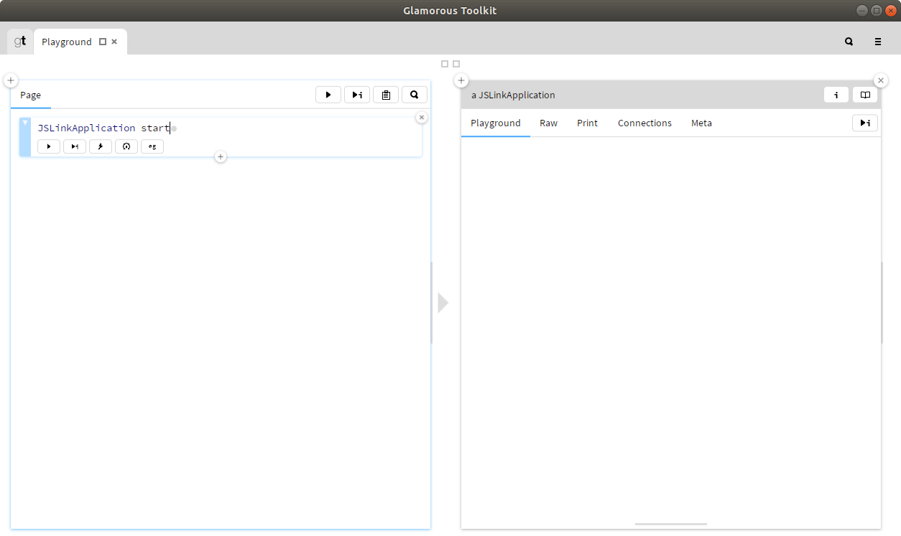
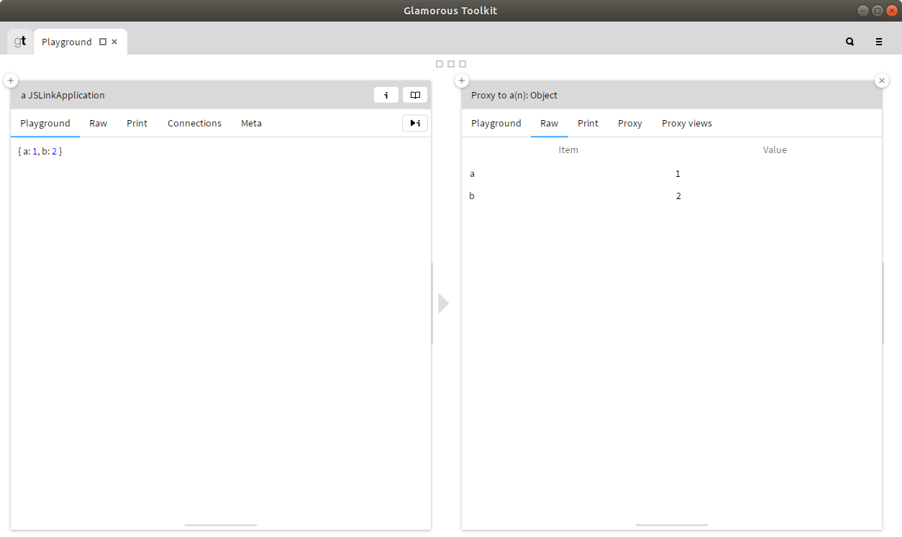
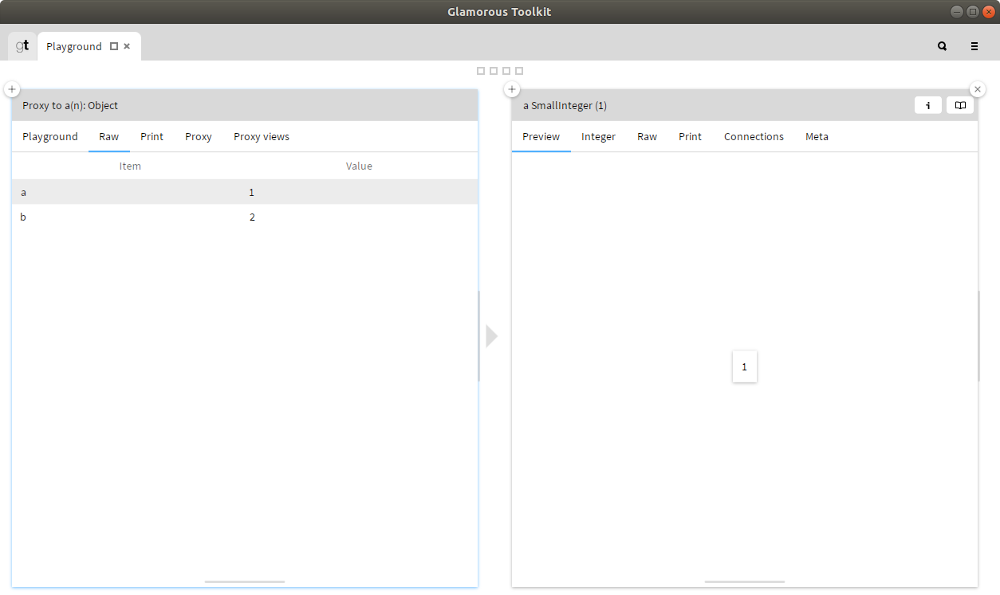
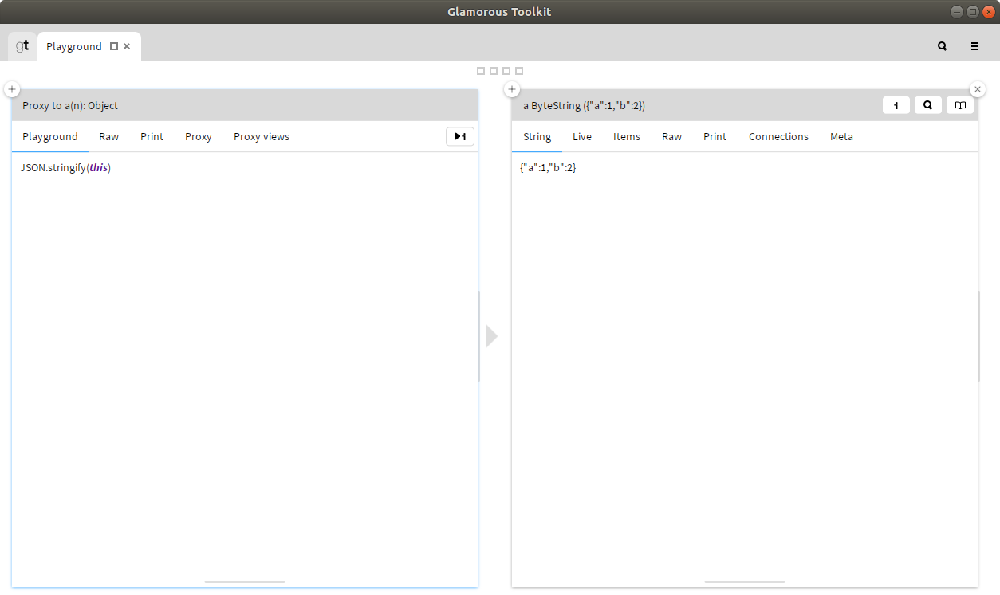

# JSLink

JSLink provides a mechanism for Pharo to communicate with libraries and applications implemented in node.js.


JSLink is based on [PythonBridge](https://github.com/ObjectProfile/PythonBridge) and provides functionality for accessing JavaScript libraries from Pharo.

## Getting Started 


### Installation

Requirements:

JSLink has been tested with:

- Pharo 8
- node.js 8.x

To install JSLink in Pharo evaluate:

```smalltalk
EpMonitor disableDuring: [ 
Metacello new
	repository: 'github://feenkcom/JSlink/src';
	baseline: 'JavaScriptLink';
	load ]
```


### First statements

When first running JSLink it is worthwhile starting Pharo from the command line so you can monitor the output.

Open a playground in [Gtoolkit](https://gtoolkit.com/) and start the JSLinkApplication:



This will automatically install all the dependent modules with `npm`:

```
$ vmgt/gtoolkit Pharo.image eval --interactive --no-quit "GtWorld open."
GtWorld
[Glutin] Profile #0 worked
[Glutin] Profile #0 worked
loadDep:fsevents → 304    ▌ ╢███████████████████████░░░░░░░░░░░░░░░░░░░░░░░░░░░░░░░░░░░░░░░░░░░░░░░╟
WARN engine fsevents@2.1.2: wanted: {"node":"^8.16.0 || ^10.6.0 || >=11.0.0"} (current: {"node":"8.10loadDep:react-is → header ▐ ╢███████████████████████░░░░░░░░░░░░░░░░░░░░░░░░░░░░░░░░░░░░░░░░░░░░░░░╟
loadDep:execa → resolveWi ▐ ╢███████████████████████░░░░░░░░░░░░░░░░░░░░░░░░░░░░░░░░░░░░░░░░░░░░░░░╟
WARN engine execa@3.4.0: wanted: {"node":"^8.12.0 || >=9.7.0"} (current: {"node":"8.10.0","npm":"3.5.loadDep:strip-final-newli ▐ ╢███████████████████████░░░░░░░░░░░░░░░░░░░░░░░░░░░░░░░░░░░░░░░░░░░░░░░╟
WARN engine human-signals@1.1.1: wanted: {"node":">=8.12.0"} (current: {"node":"8.10.0","npm":"3.5.2"
> sqlite3@4.1.1 install /home/alistair/pharo8/so07/pharo-local/iceberg/feenkcom/JSlink/js/node_modules/sqlite3
> node-pre-gyp install --fallback-to-build
...
```

We now evaluate our first expression in JavaScript:



After typing the code in to the playground it is evaluated by pressing the play & inspect button:


From here we can navigate through the attributes of the object in the same way as when inspecting pharo objects.

If the value of the attribute is a non-primitive object, a proxy will be returned, if it is a primitive, it will be returned directly:



When evaluating statements in a proxy object's playground, `this` is bound to the proxy object:



The node.js server can then be stopped with:

```smalltalk
JSLinkApplication stop.
```


### Programatic Use

So far we have been using a global instance of JSLink, however it is possible to have multiple servers running concurrently through the use of private instances.

For this example we'll create an Excel spreadsheet by installing and using the existing `excel4node` module.

To install the module:

